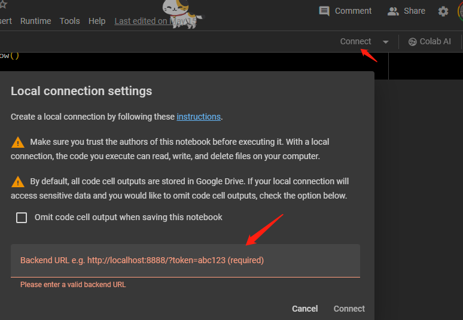

In building this Bloomberg Api Sample File, I refered to multiple resourses from XBBG example, Stack Overflows and Bloomberg Official API document. I updated all the package info and codes to the newest version. I hope this sample file can be helpful.

# Prepare


## Prepare Terminal Device

This is about how to use Python API for bloomberg through google colab.
1. Sign to a device with bloomberg terminal.
2. Make sure the Jupyter is insalled on the device. If not, install anaconda or use pip install to install jupyter on the device.
3. After this step, open terminal or Anaconda Powershell Prompt, paste following code and run:
```
  jupyter notebook \
    --NotebookApp.allow_origin='https://colab.research.google.com' \
    --port=8888 \
    --NotebookApp.port_retries=0
```
Note that after experiments, the way that install anaconda and run above code in Anaconda Powershell Prompt is one of the easiest ways to success. (At Scheller Trading Floor Bloomberg terminal).
4. After run above code, from the output " Or copy and paste one of these URLs:", copy and paste one of the urls shown to the colab $→$ Connect to a local runtime $→$ Backend Url



Now, we finished the basic settings to use this colab notebook to get data from bloomberg.


## Prepare API environment

### Easier to use package: XBBG

To set up the Bloomberg API, we need to run the following codes:


```python
import pandas as pd
import numpy as np
!pip install blpapi --index-url=https://bcms.bloomberg.com/pip/simple/
!pip install xbbg
from xbbg import blp, pipeline
```

    Looking in indexes: https://bcms.bloomberg.com/pip/simple/
    Requirement already satisfied: blpapi in c:\users\yzhang3654\appdata\local\anaconda3\lib\site-packages (3.24.4)
    Requirement already satisfied: xbbg in c:\users\yzhang3654\appdata\local\anaconda3\lib\site-packages (0.7.5a4)
    Requirement already satisfied: numpy>=1.15.0 in c:\users\yzhang3654\appdata\local\anaconda3\lib\site-packages (from xbbg) (1.26.4)
    Requirement already satisfied: pandas>=1.0.0 in c:\users\yzhang3654\appdata\local\anaconda3\lib\site-packages (from xbbg) (2.1.4)
    Requirement already satisfied: pyarrow>=1.0.1 in c:\users\yzhang3654\appdata\local\anaconda3\lib\site-packages (from xbbg) (14.0.2)
    Requirement already satisfied: pytz>=2020.4 in c:\users\yzhang3654\appdata\local\anaconda3\lib\site-packages (from xbbg) (2023.3.post1)
    Requirement already satisfied: ruamel.yaml>=0.15.0 in c:\users\yzhang3654\appdata\local\anaconda3\lib\site-packages (from xbbg) (0.17.21)
    Requirement already satisfied: pytest in c:\users\yzhang3654\appdata\local\anaconda3\lib\site-packages (from xbbg) (7.4.0)
    Requirement already satisfied: python-dateutil>=2.8.2 in c:\users\yzhang3654\appdata\local\anaconda3\lib\site-packages (from pandas>=1.0.0->xbbg) (2.8.2)
    Requirement already satisfied: tzdata>=2022.1 in c:\users\yzhang3654\appdata\local\anaconda3\lib\site-packages (from pandas>=1.0.0->xbbg) (2023.3)
    Requirement already satisfied: iniconfig in c:\users\yzhang3654\appdata\local\anaconda3\lib\site-packages (from pytest->xbbg) (1.1.1)
    Requirement already satisfied: packaging in c:\users\yzhang3654\appdata\local\anaconda3\lib\site-packages (from pytest->xbbg) (23.1)
    Requirement already satisfied: pluggy<2.0,>=0.12 in c:\users\yzhang3654\appdata\local\anaconda3\lib\site-packages (from pytest->xbbg) (1.0.0)
    Requirement already satisfied: colorama in c:\users\yzhang3654\appdata\local\anaconda3\lib\site-packages (from pytest->xbbg) (0.4.6)
    Requirement already satisfied: six>=1.5 in c:\users\yzhang3654\appdata\local\anaconda3\lib\site-packages (from python-dateutil>=2.8.2->pandas>=1.0.0->xbbg) (1.16.0)
    


```python
from numpy import unique
```

Test the version of the api


```python
blp.__version__
```


    '0.7.5a4'


A simple test to check the connection to bloomberg terminal.


```python
blp.bdp('AAPL US Equity', flds=['Security_Name', 'Last_Price'])
```


<div>
<style scoped>
    .dataframe tbody tr th:only-of-type {
        vertical-align: middle;
    }

    .dataframe tbody tr th {
        vertical-align: top;
    }

    .dataframe thead th {
        text-align: right;
    }
</style>
<table border="1" class="dataframe">
  <thead>
    <tr style="text-align: right;">
      <th></th>
      <th>security_name</th>
      <th>last_price</th>
    </tr>
  </thead>
  <tbody>
    <tr>
      <th>AAPL US Equity</th>
      <td>Apple Inc</td>
      <td>189.72</td>
    </tr>
  </tbody>
</table>
</div>


### Raw API

This cell is for raw Bloomberg API setup


```python
!pip install blpapi

import blpapi
from datetime import datetime
```

    Requirement already satisfied: blpapi in c:\users\yzhang3654\appdata\local\anaconda3\lib\site-packages (3.24.4)
    

# Data Collection Examples

In this section, I will show detailed examples and explainations to different functions of bloomberg api, for more detailed information of functions, you can use help command to check the parameters of each functions.

## Bloomberg Data Point

BDP (Bloomberg data point): returns data to a single cell. It contains only one
ticker and one field.
* It is suitable for questions like *What is the last price of google?*
* This is similar to excel function
Formula Syntax: =BDP (“Security”, “Field”)


```python
blp.bdp('GOOG US Equity', flds=['Security_Name', 'Last_Price'])
```


<div>
<style scoped>
    .dataframe tbody tr th:only-of-type {
        vertical-align: middle;
    }

    .dataframe tbody tr th {
        vertical-align: top;
    }

    .dataframe thead th {
        text-align: right;
    }
</style>
<table border="1" class="dataframe">
  <thead>
    <tr style="text-align: right;">
      <th></th>
      <th>security_name</th>
      <th>last_price</th>
    </tr>
  </thead>
  <tbody>
    <tr>
      <th>GOOG US Equity</th>
      <td>Alphabet Inc</td>
      <td>173.88</td>
    </tr>
  </tbody>
</table>
</div>


```python
blp.bdp('AAPL US Equity', flds=['Security_Name','Last_Price'])
```


<div>
<style scoped>
    .dataframe tbody tr th:only-of-type {
        vertical-align: middle;
    }

    .dataframe tbody tr th {
        vertical-align: top;
    }

    .dataframe thead th {
        text-align: right;
    }
</style>
<table border="1" class="dataframe">
  <thead>
    <tr style="text-align: right;">
      <th></th>
      <th>security_name</th>
      <th>last_price</th>
    </tr>
  </thead>
  <tbody>
    <tr>
      <th>AAPL US Equity</th>
      <td>Apple Inc</td>
      <td>189.72</td>
    </tr>
  </tbody>
</table>
</div>


```python
blp.bdp('6758 JP Equity', flds='Crncy_Adj_Mkt_Cap', Eqy_Fund_Crncy='USD')
```


<div>
<style scoped>
    .dataframe tbody tr th:only-of-type {
        vertical-align: middle;
    }

    .dataframe tbody tr th {
        vertical-align: top;
    }

    .dataframe thead th {
        text-align: right;
    }
</style>
<table border="1" class="dataframe">
  <thead>
    <tr style="text-align: right;">
      <th></th>
      <th>crncy_adj_mkt_cap</th>
    </tr>
  </thead>
  <tbody>
    <tr>
      <th>6758 JP Equity</th>
      <td>104655.884038</td>
    </tr>
  </tbody>
</table>
</div>


```python
blp.bdp(tickers='AAPL US Equity', flds=['Security_Name', 'GICS_Sector_Name','PX_last', 'HISTORICAL_MARKET_CAP']).head()
```


<div>
<style scoped>
    .dataframe tbody tr th:only-of-type {
        vertical-align: middle;
    }

    .dataframe tbody tr th {
        vertical-align: top;
    }

    .dataframe thead th {
        text-align: right;
    }
</style>
<table border="1" class="dataframe">
  <thead>
    <tr style="text-align: right;">
      <th></th>
      <th>security_name</th>
      <th>gics_sector_name</th>
      <th>px_last</th>
      <th>historical_market_cap</th>
    </tr>
  </thead>
  <tbody>
    <tr>
      <th>AAPL US Equity</th>
      <td>Apple Inc</td>
      <td>Information Technology</td>
      <td>189.72</td>
      <td>2630106.39528</td>
    </tr>
  </tbody>
</table>
</div>


## Bloomberg Data Set

BDS (Bloomberg Data Set) This formula returns multi-cell descriptive data. This is for bulk/multi cell data.
* It is suitabl for questions like *Retrieve the top 20 shareholders of Google*
* Formula Syntax: =BDS (“Security”, “Field”, “Optional Arguments”)


```python
holders = blp.bds('GOOG US Equity', flds='Top_20_Holders_Public_Filings', cache=True)
holders.head()
```


<div>
<style scoped>
    .dataframe tbody tr th:only-of-type {
        vertical-align: middle;
    }

    .dataframe tbody tr th {
        vertical-align: top;
    }

    .dataframe thead th {
        text-align: right;
    }
</style>
<table border="1" class="dataframe">
  <thead>
    <tr style="text-align: right;">
      <th></th>
      <th>holder_name</th>
      <th>portfolio_name</th>
      <th>source</th>
      <th>amount_held</th>
      <th>percent_outstanding</th>
      <th>latest_change</th>
      <th>filing_date</th>
      <th>institution_type</th>
      <th>country</th>
      <th>metro_area</th>
    </tr>
  </thead>
  <tbody>
    <tr>
      <th>GOOG US Equity</th>
      <td>Vanguard Group Inc/T</td>
      <td>n/a</td>
      <td>ULT-AGG</td>
      <td>411921073.0</td>
      <td>7.33</td>
      <td>932245.0</td>
      <td>2024-03-31</td>
      <td>Investment Advisor</td>
      <td>United States</td>
      <td>Philadelphia</td>
    </tr>
    <tr>
      <th>GOOG US Equity</th>
      <td>Page Lawrence E</td>
      <td>n/a</td>
      <td>Form 4</td>
      <td>390272280.0</td>
      <td>6.95</td>
      <td>-277760.0</td>
      <td>2022-04-19</td>
      <td>Unclassified</td>
      <td>n/a</td>
      <td>Unclassified</td>
    </tr>
    <tr>
      <th>GOOG US Equity</th>
      <td>Brin Sergey Mikhailo</td>
      <td>n/a</td>
      <td>Form 4</td>
      <td>367312400.0</td>
      <td>6.54</td>
      <td>-2601500.0</td>
      <td>2023-05-11</td>
      <td>Unclassified</td>
      <td>n/a</td>
      <td>Unclassified</td>
    </tr>
    <tr>
      <th>GOOG US Equity</th>
      <td>BlackRock Inc</td>
      <td>n/a</td>
      <td>13G</td>
      <td>356934964.0</td>
      <td>6.35</td>
      <td>356934964.0</td>
      <td>2023-12-31</td>
      <td>Investment Advisor</td>
      <td>United States</td>
      <td>New York City/Southern CT/Northern NJ</td>
    </tr>
    <tr>
      <th>GOOG US Equity</th>
      <td>State Street Corp</td>
      <td>n/a</td>
      <td>ULT-AGG</td>
      <td>190762518.0</td>
      <td>3.40</td>
      <td>387787.0</td>
      <td>2024-03-31</td>
      <td>Investment Advisor</td>
      <td>United States</td>
      <td>Boston</td>
    </tr>
  </tbody>
</table>
</div>


We can make some edit to the data to make the data more clear.


```python
holders = blp.bds('AMZN US Equity', flds='All_Holders_Public_Filings', cache=True)
(
    holders
    .loc[:, ~holders.columns.str.contains(
        f'holder_id|portfolio_name|change|number|'
        f'metro|percent_of_portfolio|source'
    )]
    .rename(
        index=lambda tkr: tkr.replace(' Equity', ''),
        columns={
            'holder_name_': 'holder',
            'position_': 'position',
            'filing_date__': 'filing_dt',
            'percent_outstanding': 'pct_out',
            'insider_status_': 'insider',
        }
    )
).head()
```


<div>
<style scoped>
    .dataframe tbody tr th:only-of-type {
        vertical-align: middle;
    }

    .dataframe tbody tr th {
        vertical-align: top;
    }

    .dataframe thead th {
        text-align: right;
    }
</style>
<table border="1" class="dataframe">
  <thead>
    <tr style="text-align: right;">
      <th></th>
      <th>holder</th>
      <th>position</th>
      <th>filing_dt</th>
      <th>insider</th>
      <th>pct_out</th>
      <th>institution_type_</th>
      <th>country</th>
    </tr>
  </thead>
  <tbody>
    <tr>
      <th>AMZN US</th>
      <td>Bezos Jeffrey Preston</td>
      <td>937773965.0</td>
      <td>2024-03-04</td>
      <td>Y</td>
      <td>9.01</td>
      <td>Unclassified</td>
      <td>n/a</td>
    </tr>
    <tr>
      <th>AMZN US</th>
      <td>Vanguard Group Inc/The</td>
      <td>785811114.0</td>
      <td>2024-03-31</td>
      <td>N-P</td>
      <td>7.55</td>
      <td>Investment Advisor</td>
      <td>United States</td>
    </tr>
    <tr>
      <th>AMZN US</th>
      <td>BlackRock Inc</td>
      <td>630188686.0</td>
      <td>2023-12-31</td>
      <td>N-P</td>
      <td>6.06</td>
      <td>Investment Advisor</td>
      <td>United States</td>
    </tr>
    <tr>
      <th>AMZN US</th>
      <td>State Street Corp</td>
      <td>351606995.0</td>
      <td>2024-03-31</td>
      <td>N-P</td>
      <td>3.38</td>
      <td>Investment Advisor</td>
      <td>United States</td>
    </tr>
    <tr>
      <th>AMZN US</th>
      <td>FMR LLC</td>
      <td>325059822.0</td>
      <td>2024-03-31</td>
      <td>N-P</td>
      <td>3.12</td>
      <td>Investment Advisor</td>
      <td>United States</td>
    </tr>
  </tbody>
</table>
</div>


### Dividend Data

Dividend data is built in a seperate function.


```python
help(blp.dividend)
```

    Help on function dividend in module xbbg.blp:
    
    dividend(tickers, typ='all', start_date=None, end_date=None, **kwargs) -> pandas.core.frame.DataFrame
        Bloomberg dividend / split history
        
        Args:
            tickers: list of tickers
            typ: dividend adjustment type
                `all`:       `DVD_Hist_All`
                `dvd`:       `DVD_Hist`
                `split`:     `Eqy_DVD_Hist_Splits`
                `gross`:     `Eqy_DVD_Hist_Gross`
                `adjust`:    `Eqy_DVD_Adjust_Fact`
                `adj_fund`:  `Eqy_DVD_Adj_Fund`
                `with_amt`:  `DVD_Hist_All_with_Amt_Status`
                `dvd_amt`:   `DVD_Hist_with_Amt_Status`
                `gross_amt`: `DVD_Hist_Gross_with_Amt_Stat`
                `projected`: `BDVD_Pr_Ex_Dts_DVD_Amts_w_Ann`
            start_date: start date
            end_date: end date
            **kwargs: overrides
        
        Returns:
            pd.DataFrame
    
    


```python
blp.dividend('SPY US Equity', start_date='2020').head()
```


<div>
<style scoped>
    .dataframe tbody tr th:only-of-type {
        vertical-align: middle;
    }

    .dataframe tbody tr th {
        vertical-align: top;
    }

    .dataframe thead th {
        text-align: right;
    }
</style>
<table border="1" class="dataframe">
  <thead>
    <tr style="text-align: right;">
      <th></th>
      <th>dec_date</th>
      <th>ex_date</th>
      <th>rec_date</th>
      <th>pay_date</th>
      <th>dvd_amt</th>
      <th>dvd_freq</th>
      <th>dvd_type</th>
    </tr>
  </thead>
  <tbody>
    <tr>
      <th>SPY US Equity</th>
      <td>2024-03-14</td>
      <td>2024-03-15</td>
      <td>2024-03-18</td>
      <td>2024-04-30</td>
      <td>1.594937</td>
      <td>Quarter</td>
      <td>Income</td>
    </tr>
    <tr>
      <th>SPY US Equity</th>
      <td>2023-12-14</td>
      <td>2023-12-15</td>
      <td>2023-12-18</td>
      <td>2024-01-31</td>
      <td>1.906073</td>
      <td>Quarter</td>
      <td>Income</td>
    </tr>
    <tr>
      <th>SPY US Equity</th>
      <td>2023-09-14</td>
      <td>2023-09-15</td>
      <td>2023-09-18</td>
      <td>2023-10-31</td>
      <td>1.583169</td>
      <td>Quarter</td>
      <td>Income</td>
    </tr>
    <tr>
      <th>SPY US Equity</th>
      <td>2023-06-15</td>
      <td>2023-06-16</td>
      <td>2023-06-20</td>
      <td>2023-07-31</td>
      <td>1.638367</td>
      <td>Quarter</td>
      <td>Income</td>
    </tr>
    <tr>
      <th>SPY US Equity</th>
      <td>2023-03-16</td>
      <td>2023-03-17</td>
      <td>2023-03-20</td>
      <td>2023-04-28</td>
      <td>1.506204</td>
      <td>Quarter</td>
      <td>Income</td>
    </tr>
  </tbody>
</table>
</div>


### Earning Data

Earning data is built in a seperate funciton.


```python
help(blp.earning)
```

    Help on function earning in module xbbg.blp:
    
    earning(ticker, by='Geo', typ='Revenue', ccy=None, level=None, **kwargs) -> pandas.core.frame.DataFrame
        Earning exposures by Geo or Products
        
        Args:
            ticker: ticker name
            by: [G(eo), P(roduct)]
            typ: type of earning, start with `PG_` in Bloomberg FLDS - default `Revenue`
                `Revenue` - Revenue of the company
                `Operating_Income` - Operating Income (also named as EBIT) of the company
                `Assets` - Assets of the company
                `Gross_Profit` - Gross profit of the company
                `Capital_Expenditures` - Capital expenditures of the company
            ccy: currency of earnings
            level: hierarchy level of earnings
        
        Returns:
            pd.DataFrame
    
    

But we don't have access to this data. We need to get access to them from WRDS.

## Bloomberg Historical Data


```python
help(blp.bdh)
```

    Help on function bdh in module xbbg.blp:
    
    bdh(tickers, flds=None, start_date=None, end_date='today', adjust=None, **kwargs) -> pandas.core.frame.DataFrame
        Bloomberg historical data
        
        Args:
            tickers: ticker(s)
            flds: field(s)
            start_date: start date
            end_date: end date - default today
            adjust: `all`, `dvd`, `normal`, `abn` (=abnormal), `split`, `-` or None
                    exact match of above words will adjust for corresponding events
                    Case 0: `-` no adjustment for dividend or split
                    Case 1: `dvd` or `normal|abn` will adjust for all dividends except splits
                    Case 2: `adjust` will adjust for splits and ignore all dividends
                    Case 3: `all` == `dvd|split` == adjust for all
                    Case 4: None == Bloomberg default OR use kwargs
            **kwargs: overrides
        
        Returns:
            pd.DataFrame
    
    

### Stock Data


```python
blp.bdh(
    tickers='SHCOMP Index', flds=['high', 'low', 'open', 'last_price'],
    start_date='2022-11', end_date='2023', Per='W', Fill='P', Days='A',
).head()
```


<div>
<style scoped>
    .dataframe tbody tr th:only-of-type {
        vertical-align: middle;
    }

    .dataframe tbody tr th {
        vertical-align: top;
    }

    .dataframe thead tr th {
        text-align: left;
    }
</style>
<table border="1" class="dataframe">
  <thead>
    <tr>
      <th></th>
      <th colspan="4" halign="left">SHCOMP Index</th>
    </tr>
    <tr>
      <th></th>
      <th>high</th>
      <th>low</th>
      <th>open</th>
      <th>last_price</th>
    </tr>
  </thead>
  <tbody>
    <tr>
      <th>2022-11-04</th>
      <td>3081.590</td>
      <td>2885.089</td>
      <td>2893.196</td>
      <td>3070.796</td>
    </tr>
    <tr>
      <th>2022-11-11</th>
      <td>3117.742</td>
      <td>3022.851</td>
      <td>3062.859</td>
      <td>3087.292</td>
    </tr>
    <tr>
      <th>2022-11-18</th>
      <td>3145.753</td>
      <td>3074.498</td>
      <td>3100.867</td>
      <td>3097.243</td>
    </tr>
    <tr>
      <th>2022-11-25</th>
      <td>3118.120</td>
      <td>3056.170</td>
      <td>3078.057</td>
      <td>3101.693</td>
    </tr>
    <tr>
      <th>2022-12-02</th>
      <td>3198.409</td>
      <td>3034.705</td>
      <td>3055.290</td>
      <td>3156.144</td>
    </tr>
  </tbody>
</table>
</div>


Dividend / Split Adjustment


```python
pd.concat([
    blp.bdh(
        'AAPL US Equity', 'Px_Last', '20140605', '20140610',
        CshAdjNormal=True, CshAdjAbnormal=True, CapChg=True
    ).rename(columns={'Px_Last': 'Px_Adj'}),
    blp.bdh(
        'AAPL US Equity', 'Px_Last', '20140605', '20140610',
        CshAdjNormal=False, CshAdjAbnormal=False, CapChg=False
    ).rename(columns={'Px_Last': 'Px_Raw'}),
], axis=1)
```


<div>
<style scoped>
    .dataframe tbody tr th:only-of-type {
        vertical-align: middle;
    }

    .dataframe tbody tr th {
        vertical-align: top;
    }

    .dataframe thead tr th {
        text-align: left;
    }
</style>
<table border="1" class="dataframe">
  <thead>
    <tr>
      <th></th>
      <th colspan="2" halign="left">AAPL US Equity</th>
    </tr>
    <tr>
      <th></th>
      <th>Px_Adj</th>
      <th>Px_Raw</th>
    </tr>
  </thead>
  <tbody>
    <tr>
      <th>2014-06-05</th>
      <td>20.450</td>
      <td>647.35</td>
    </tr>
    <tr>
      <th>2014-06-06</th>
      <td>20.394</td>
      <td>645.57</td>
    </tr>
    <tr>
      <th>2014-06-09</th>
      <td>20.720</td>
      <td>93.70</td>
    </tr>
    <tr>
      <th>2014-06-10</th>
      <td>20.842</td>
      <td>94.25</td>
    </tr>
  </tbody>
</table>
</div>


### Option Data


```python
blp.bdh('TSLA US Equity',['PX_LAST','IVOL_Delta','VOLUME_TOTAL_CALL'],datetime(2023,8,4),datetime(2023,8,19),
                 IVOL_DELTA_LEVEL='DELTA_LVL_25',
                 IVOL_MATURITY='MATURITY_0D',
                 IVOL_DELTA_PUT_OR_CALL='IVOL_CALL').head()
```


<div>
<style scoped>
    .dataframe tbody tr th:only-of-type {
        vertical-align: middle;
    }

    .dataframe tbody tr th {
        vertical-align: top;
    }

    .dataframe thead tr th {
        text-align: left;
    }
</style>
<table border="1" class="dataframe">
  <thead>
    <tr>
      <th></th>
      <th colspan="3" halign="left">TSLA US Equity</th>
    </tr>
    <tr>
      <th></th>
      <th>PX_LAST</th>
      <th>IVOL_Delta</th>
      <th>VOLUME_TOTAL_CALL</th>
    </tr>
  </thead>
  <tbody>
    <tr>
      <th>2023-08-04</th>
      <td>253.86</td>
      <td>42.4726</td>
      <td>1537802.0</td>
    </tr>
    <tr>
      <th>2023-08-07</th>
      <td>251.45</td>
      <td>39.5239</td>
      <td>1064559.0</td>
    </tr>
    <tr>
      <th>2023-08-08</th>
      <td>249.70</td>
      <td>39.6448</td>
      <td>641504.0</td>
    </tr>
    <tr>
      <th>2023-08-09</th>
      <td>242.19</td>
      <td>41.8794</td>
      <td>841410.0</td>
    </tr>
    <tr>
      <th>2023-08-10</th>
      <td>245.34</td>
      <td>39.5430</td>
      <td>1102788.0</td>
    </tr>
  </tbody>
</table>
</div>


## Bloomberg Intraday Bars

Function to get previous day


```python
cur_dt = pd.Timestamp('today', tz='America/New_York').date()

# Range of the last two business days including today
recent = pd.bdate_range(end=cur_dt, periods=2, tz='America/New_York')

# Getting the date just before today which is also a business day
# We convert it to date format to remove any timezone information for simplicity
pre_dt = recent[0].date()
pre_dt
```


    datetime.date(2024, 5, 15)


```python
help(blp.bdib)
```

    Help on function bdib in module xbbg.blp:
    
    bdib(ticker: str, dt, session='allday', typ='TRADE', **kwargs) -> pandas.core.frame.DataFrame
        Bloomberg intraday bar data
        
        Args:
            ticker: ticker name
            dt: date to download
            session: [allday, day, am, pm, pre, post]
            typ: [TRADE, BID, ASK, BID_BEST, ASK_BEST, BEST_BID, BEST_ASK]
            **kwargs:
                ref: reference ticker or exchange
                     used as supplement if exchange info is not defined for `ticker`
                batch: whether is batch process to download data
                log: level of logs
        
        Returns:
            pd.DataFrame
    
    

### Stock Data


```python
blp.bdib('QQQ US Equity', dt=pre_dt, session='day').tail()
```


<div>
<style scoped>
    .dataframe tbody tr th:only-of-type {
        vertical-align: middle;
    }

    .dataframe tbody tr th {
        vertical-align: top;
    }

    .dataframe thead tr th {
        text-align: left;
    }
</style>
<table border="1" class="dataframe">
  <thead>
    <tr>
      <th></th>
      <th colspan="7" halign="left">QQQ US Equity</th>
    </tr>
    <tr>
      <th></th>
      <th>open</th>
      <th>high</th>
      <th>low</th>
      <th>close</th>
      <th>volume</th>
      <th>num_trds</th>
      <th>value</th>
    </tr>
  </thead>
  <tbody>
    <tr>
      <th>2024-05-14 15:55:00-04:00</th>
      <td>446.380</td>
      <td>446.38</td>
      <td>446.290</td>
      <td>446.380</td>
      <td>198977</td>
      <td>1136</td>
      <td>88809112.0</td>
    </tr>
    <tr>
      <th>2024-05-14 15:56:00-04:00</th>
      <td>446.382</td>
      <td>446.46</td>
      <td>446.340</td>
      <td>446.380</td>
      <td>281996</td>
      <td>1457</td>
      <td>125880752.0</td>
    </tr>
    <tr>
      <th>2024-05-14 15:57:00-04:00</th>
      <td>446.380</td>
      <td>446.45</td>
      <td>446.330</td>
      <td>446.355</td>
      <td>493353</td>
      <td>2235</td>
      <td>220232448.0</td>
    </tr>
    <tr>
      <th>2024-05-14 15:58:00-04:00</th>
      <td>446.350</td>
      <td>446.38</td>
      <td>446.275</td>
      <td>446.305</td>
      <td>335184</td>
      <td>1392</td>
      <td>149599264.0</td>
    </tr>
    <tr>
      <th>2024-05-14 15:59:00-04:00</th>
      <td>446.305</td>
      <td>446.31</td>
      <td>445.920</td>
      <td>445.930</td>
      <td>1255656</td>
      <td>4408</td>
      <td>560149184.0</td>
    </tr>
  </tbody>
</table>
</div>


Use session = 'allday' to get after hour trading data.


```python
blp.bdib('QQQ US Equity', dt=pre_dt, session='allday').tail()
```


<div>
<style scoped>
    .dataframe tbody tr th:only-of-type {
        vertical-align: middle;
    }

    .dataframe tbody tr th {
        vertical-align: top;
    }

    .dataframe thead tr th {
        text-align: left;
    }
</style>
<table border="1" class="dataframe">
  <thead>
    <tr>
      <th></th>
      <th colspan="7" halign="left">QQQ US Equity</th>
    </tr>
    <tr>
      <th></th>
      <th>open</th>
      <th>high</th>
      <th>low</th>
      <th>close</th>
      <th>volume</th>
      <th>num_trds</th>
      <th>value</th>
    </tr>
  </thead>
  <tbody>
    <tr>
      <th>2024-05-14 15:57:00-04:00</th>
      <td>446.380</td>
      <td>446.45</td>
      <td>446.330</td>
      <td>446.355</td>
      <td>493353</td>
      <td>2235</td>
      <td>220232448.0</td>
    </tr>
    <tr>
      <th>2024-05-14 15:58:00-04:00</th>
      <td>446.350</td>
      <td>446.38</td>
      <td>446.275</td>
      <td>446.305</td>
      <td>335184</td>
      <td>1392</td>
      <td>149599264.0</td>
    </tr>
    <tr>
      <th>2024-05-14 15:59:00-04:00</th>
      <td>446.305</td>
      <td>446.31</td>
      <td>445.920</td>
      <td>445.930</td>
      <td>1255656</td>
      <td>4408</td>
      <td>560149184.0</td>
    </tr>
    <tr>
      <th>2024-05-14 16:14:00-04:00</th>
      <td>445.930</td>
      <td>445.93</td>
      <td>445.930</td>
      <td>445.930</td>
      <td>0</td>
      <td>1</td>
      <td>0.0</td>
    </tr>
    <tr>
      <th>2024-05-14 16:29:00-04:00</th>
      <td>445.930</td>
      <td>445.93</td>
      <td>445.930</td>
      <td>445.930</td>
      <td>0</td>
      <td>1</td>
      <td>0.0</td>
    </tr>
  </tbody>
</table>
</div>


### Option Data


```python
blp.bdib('SPX US 05/17/24 C5300 Index', dt=pre_dt, session='allday').tail()
```


<div>
<style scoped>
    .dataframe tbody tr th:only-of-type {
        vertical-align: middle;
    }

    .dataframe tbody tr th {
        vertical-align: top;
    }

    .dataframe thead tr th {
        text-align: left;
    }
</style>
<table border="1" class="dataframe">
  <thead>
    <tr>
      <th></th>
      <th colspan="7" halign="left">SPX US 05/17/24 C5300 Index</th>
    </tr>
    <tr>
      <th></th>
      <th>open</th>
      <th>high</th>
      <th>low</th>
      <th>close</th>
      <th>volume</th>
      <th>num_trds</th>
      <th>value</th>
    </tr>
  </thead>
  <tbody>
    <tr>
      <th>2024-05-14 15:52:00-04:00</th>
      <td>7.49</td>
      <td>7.49</td>
      <td>7.49</td>
      <td>7.49</td>
      <td>1</td>
      <td>1</td>
      <td>7.49</td>
    </tr>
    <tr>
      <th>2024-05-14 15:56:00-04:00</th>
      <td>7.30</td>
      <td>7.30</td>
      <td>7.30</td>
      <td>7.30</td>
      <td>2</td>
      <td>2</td>
      <td>14.60</td>
    </tr>
    <tr>
      <th>2024-05-14 15:57:00-04:00</th>
      <td>7.40</td>
      <td>7.40</td>
      <td>7.40</td>
      <td>7.40</td>
      <td>1</td>
      <td>1</td>
      <td>7.40</td>
    </tr>
    <tr>
      <th>2024-05-14 15:58:00-04:00</th>
      <td>7.50</td>
      <td>7.50</td>
      <td>7.50</td>
      <td>7.50</td>
      <td>3</td>
      <td>2</td>
      <td>22.50</td>
    </tr>
    <tr>
      <th>2024-05-14 15:59:00-04:00</th>
      <td>6.87</td>
      <td>6.87</td>
      <td>6.87</td>
      <td>6.87</td>
      <td>2</td>
      <td>1</td>
      <td>13.74</td>
    </tr>
  </tbody>
</table>
</div>


Need the ref parameter to adjust


```python
blp.bdib('AAPL US 05/17/24 C185 Equity', dt=pre_dt, ref='IndexUS').tail()
```


<div>
<style scoped>
    .dataframe tbody tr th:only-of-type {
        vertical-align: middle;
    }

    .dataframe tbody tr th {
        vertical-align: top;
    }

    .dataframe thead tr th {
        text-align: left;
    }
</style>
<table border="1" class="dataframe">
  <thead>
    <tr>
      <th></th>
      <th colspan="7" halign="left">AAPL US 05/17/24 C185 Equity</th>
    </tr>
    <tr>
      <th></th>
      <th>open</th>
      <th>high</th>
      <th>low</th>
      <th>close</th>
      <th>volume</th>
      <th>num_trds</th>
      <th>value</th>
    </tr>
  </thead>
  <tbody>
    <tr>
      <th>2024-05-14 15:55:00-04:00</th>
      <td>3.10</td>
      <td>3.13</td>
      <td>3.10</td>
      <td>3.10</td>
      <td>12</td>
      <td>6</td>
      <td>37.23</td>
    </tr>
    <tr>
      <th>2024-05-14 15:56:00-04:00</th>
      <td>3.15</td>
      <td>3.20</td>
      <td>3.15</td>
      <td>3.20</td>
      <td>17</td>
      <td>8</td>
      <td>54.27</td>
    </tr>
    <tr>
      <th>2024-05-14 15:57:00-04:00</th>
      <td>3.27</td>
      <td>3.29</td>
      <td>3.25</td>
      <td>3.25</td>
      <td>110</td>
      <td>7</td>
      <td>359.54</td>
    </tr>
    <tr>
      <th>2024-05-14 15:58:00-04:00</th>
      <td>3.25</td>
      <td>3.27</td>
      <td>3.15</td>
      <td>3.25</td>
      <td>90</td>
      <td>9</td>
      <td>293.30</td>
    </tr>
    <tr>
      <th>2024-05-14 15:59:00-04:00</th>
      <td>3.20</td>
      <td>3.22</td>
      <td>3.10</td>
      <td>3.10</td>
      <td>65</td>
      <td>11</td>
      <td>205.23</td>
    </tr>
  </tbody>
</table>
</div>


```python
blp.bdib(ticker='AAPL US 05/17/24 C185 Equity', dt=pre_dt, ref='IndexUS', fields=['delta', 'vega'])
```


<div>
<style scoped>
    .dataframe tbody tr th:only-of-type {
        vertical-align: middle;
    }

    .dataframe tbody tr th {
        vertical-align: top;
    }

    .dataframe thead tr th {
        text-align: left;
    }
</style>
<table border="1" class="dataframe">
  <thead>
    <tr>
      <th></th>
      <th colspan="7" halign="left">AAPL US 05/17/24 C185 Equity</th>
    </tr>
    <tr>
      <th></th>
      <th>open</th>
      <th>high</th>
      <th>low</th>
      <th>close</th>
      <th>volume</th>
      <th>num_trds</th>
      <th>value</th>
    </tr>
  </thead>
  <tbody>
    <tr>
      <th>2024-05-14 09:31:00-04:00</th>
      <td>3.77</td>
      <td>3.90</td>
      <td>3.35</td>
      <td>3.35</td>
      <td>881</td>
      <td>66</td>
      <td>3289.60</td>
    </tr>
    <tr>
      <th>2024-05-14 09:32:00-04:00</th>
      <td>3.35</td>
      <td>3.45</td>
      <td>3.35</td>
      <td>3.35</td>
      <td>406</td>
      <td>70</td>
      <td>1388.82</td>
    </tr>
    <tr>
      <th>2024-05-14 09:33:00-04:00</th>
      <td>3.35</td>
      <td>3.50</td>
      <td>3.25</td>
      <td>3.25</td>
      <td>156</td>
      <td>46</td>
      <td>532.71</td>
    </tr>
    <tr>
      <th>2024-05-14 09:34:00-04:00</th>
      <td>3.10</td>
      <td>3.20</td>
      <td>3.05</td>
      <td>3.18</td>
      <td>120</td>
      <td>31</td>
      <td>375.24</td>
    </tr>
    <tr>
      <th>2024-05-14 09:35:00-04:00</th>
      <td>3.30</td>
      <td>3.30</td>
      <td>3.10</td>
      <td>3.26</td>
      <td>78</td>
      <td>31</td>
      <td>250.54</td>
    </tr>
    <tr>
      <th>...</th>
      <td>...</td>
      <td>...</td>
      <td>...</td>
      <td>...</td>
      <td>...</td>
      <td>...</td>
      <td>...</td>
    </tr>
    <tr>
      <th>2024-05-14 15:55:00-04:00</th>
      <td>3.10</td>
      <td>3.13</td>
      <td>3.10</td>
      <td>3.10</td>
      <td>12</td>
      <td>6</td>
      <td>37.23</td>
    </tr>
    <tr>
      <th>2024-05-14 15:56:00-04:00</th>
      <td>3.15</td>
      <td>3.20</td>
      <td>3.15</td>
      <td>3.20</td>
      <td>17</td>
      <td>8</td>
      <td>54.27</td>
    </tr>
    <tr>
      <th>2024-05-14 15:57:00-04:00</th>
      <td>3.27</td>
      <td>3.29</td>
      <td>3.25</td>
      <td>3.25</td>
      <td>110</td>
      <td>7</td>
      <td>359.54</td>
    </tr>
    <tr>
      <th>2024-05-14 15:58:00-04:00</th>
      <td>3.25</td>
      <td>3.27</td>
      <td>3.15</td>
      <td>3.25</td>
      <td>90</td>
      <td>9</td>
      <td>293.30</td>
    </tr>
    <tr>
      <th>2024-05-14 15:59:00-04:00</th>
      <td>3.20</td>
      <td>3.22</td>
      <td>3.10</td>
      <td>3.10</td>
      <td>65</td>
      <td>11</td>
      <td>205.23</td>
    </tr>
  </tbody>
</table>
<p>351 rows × 7 columns</p>
</div>


## Bloomberg Intraday Tick Data


```python
help(blp.bdtick)
```

    Help on function bdtick in module xbbg.blp:
    
    bdtick(ticker, dt, session='allday', types=None, **kwargs) -> pandas.core.frame.DataFrame
        Bloomberg tick data
        
        Args:
            ticker: ticker name
            dt: date to download
            session: [allday, day, am, pm, pre, post]
            types: str or list, one or combinations of [
                TRADE, AT_TRADE, BID, ASK, MID_PRICE,
                BID_BEST, ASK_BEST, BEST_BID, BEST_ASK,
            ]
        
        Returns:
            pd.DataFrame
    
    

### Stock Tick Level Data


```python
blp.bdtick('TSLA US Equity', dt=pre_dt).tail()
```


<div>
<style scoped>
    .dataframe tbody tr th:only-of-type {
        vertical-align: middle;
    }

    .dataframe tbody tr th {
        vertical-align: top;
    }

    .dataframe thead tr th {
        text-align: left;
    }
</style>
<table border="1" class="dataframe">
  <thead>
    <tr>
      <th></th>
      <th colspan="5" halign="left">TSLA US Equity</th>
    </tr>
    <tr>
      <th></th>
      <th>typ</th>
      <th>value</th>
      <th>volume</th>
      <th>cond</th>
      <th>exch</th>
    </tr>
  </thead>
  <tbody>
    <tr>
      <th>2024-05-14 09:51:59.977141-04:00</th>
      <td>TRADE</td>
      <td>177.57</td>
      <td>3</td>
      <td>R6,IS,OL</td>
      <td>K</td>
    </tr>
    <tr>
      <th>2024-05-14 09:51:59.979534-04:00</th>
      <td>TRADE</td>
      <td>177.58</td>
      <td>19</td>
      <td>Q,OL</td>
      <td>D</td>
    </tr>
    <tr>
      <th>2024-05-14 09:51:59.980286-04:00</th>
      <td>TRADE</td>
      <td>177.58</td>
      <td>300</td>
      <td>R6,IS</td>
      <td>Z</td>
    </tr>
    <tr>
      <th>2024-05-14 09:51:59.980587-04:00</th>
      <td>TRADE</td>
      <td>177.58</td>
      <td>100</td>
      <td>N</td>
      <td>D</td>
    </tr>
    <tr>
      <th>2024-05-14 09:51:59.986661-04:00</th>
      <td>TRADE</td>
      <td>177.58</td>
      <td>1</td>
      <td>Q,OL</td>
      <td>D</td>
    </tr>
  </tbody>
</table>
</div>


```python
blp.bdtick('AAPL US Equity', dt=pre_dt).tail()
```


<div>
<style scoped>
    .dataframe tbody tr th:only-of-type {
        vertical-align: middle;
    }

    .dataframe tbody tr th {
        vertical-align: top;
    }

    .dataframe thead tr th {
        text-align: left;
    }
</style>
<table border="1" class="dataframe">
  <thead>
    <tr>
      <th></th>
      <th colspan="5" halign="left">AAPL US Equity</th>
    </tr>
    <tr>
      <th></th>
      <th>typ</th>
      <th>value</th>
      <th>volume</th>
      <th>cond</th>
      <th>exch</th>
    </tr>
  </thead>
  <tbody>
    <tr>
      <th>2024-05-14 16:00:00.519780-04:00</th>
      <td>TRADE</td>
      <td>445.88</td>
      <td>30</td>
      <td>FT,OL</td>
      <td>Q</td>
    </tr>
    <tr>
      <th>2024-05-14 16:00:00.644831-04:00</th>
      <td>TRADE</td>
      <td>445.87</td>
      <td>800</td>
      <td>FT,R6,IS</td>
      <td>P</td>
    </tr>
    <tr>
      <th>2024-05-14 16:00:00.645722-04:00</th>
      <td>TRADE</td>
      <td>445.87</td>
      <td>800</td>
      <td>FT,R6,IS</td>
      <td>P</td>
    </tr>
    <tr>
      <th>2024-05-14 16:00:00.831138-04:00</th>
      <td>TRADE</td>
      <td>445.88</td>
      <td>100</td>
      <td>FT</td>
      <td>Q</td>
    </tr>
    <tr>
      <th>2024-05-14 16:00:00.917392-04:00</th>
      <td>TRADE</td>
      <td>445.93</td>
      <td>1168</td>
      <td>FT,Q,AP</td>
      <td>D</td>
    </tr>
  </tbody>
</table>
</div>


### Option Tick Level Data


```python
blp.bdtick('TSLA US 05/17/24 C480 Equity', dt=pre_dt, ref='IndexUS').tail()
```


<div>
<style scoped>
    .dataframe tbody tr th:only-of-type {
        vertical-align: middle;
    }

    .dataframe tbody tr th {
        vertical-align: top;
    }

    .dataframe thead tr th {
        text-align: left;
    }
</style>
<table border="1" class="dataframe">
  <thead>
    <tr>
      <th></th>
      <th colspan="5" halign="left">TSLA US 05/17/24 C480 Equity</th>
    </tr>
    <tr>
      <th></th>
      <th>typ</th>
      <th>value</th>
      <th>volume</th>
      <th>cond</th>
      <th>exch</th>
    </tr>
  </thead>
  <tbody>
    <tr>
      <th>2024-05-14 09:37:16-04:00</th>
      <td>TRADE</td>
      <td>0.01</td>
      <td>10</td>
      <td>ET</td>
      <td>B</td>
    </tr>
    <tr>
      <th>2024-05-14 10:27:44-04:00</th>
      <td>TRADE</td>
      <td>0.01</td>
      <td>1</td>
      <td>ME</td>
      <td>W</td>
    </tr>
    <tr>
      <th>2024-05-14 11:02:07-04:00</th>
      <td>TRADE</td>
      <td>0.01</td>
      <td>1</td>
      <td>ME</td>
      <td>O</td>
    </tr>
    <tr>
      <th>2024-05-14 11:30:13-04:00</th>
      <td>TRADE</td>
      <td>0.01</td>
      <td>2</td>
      <td>ET</td>
      <td>B</td>
    </tr>
    <tr>
      <th>2024-05-14 11:33:13-04:00</th>
      <td>TRADE</td>
      <td>0.01</td>
      <td>48</td>
      <td>ET</td>
      <td>B</td>
    </tr>
  </tbody>
</table>
</div>


```python
blp.bdtick('SPX US 05/17/24 C5300 Index', dt=pre_dt, types=['TRADE', 'AT_TRADE', 'BID', 'ASK']).tail()
```


<div>
<style scoped>
    .dataframe tbody tr th:only-of-type {
        vertical-align: middle;
    }

    .dataframe tbody tr th {
        vertical-align: top;
    }

    .dataframe thead tr th {
        text-align: left;
    }
</style>
<table border="1" class="dataframe">
  <thead>
    <tr>
      <th></th>
      <th colspan="5" halign="left">SPX US 05/17/24 C5300 Index</th>
    </tr>
    <tr>
      <th></th>
      <th>typ</th>
      <th>value</th>
      <th>volume</th>
      <th>cond</th>
      <th>exch</th>
    </tr>
  </thead>
  <tbody>
    <tr>
      <th>2024-05-14 12:00:00-04:00</th>
      <td>ASK</td>
      <td>3.4</td>
      <td>968</td>
      <td>B</td>
      <td>O</td>
    </tr>
    <tr>
      <th>2024-05-14 12:00:00-04:00</th>
      <td>ASK</td>
      <td>3.4</td>
      <td>943</td>
      <td>B</td>
      <td>O</td>
    </tr>
    <tr>
      <th>2024-05-14 12:00:00-04:00</th>
      <td>ASK</td>
      <td>3.4</td>
      <td>975</td>
      <td>B</td>
      <td>O</td>
    </tr>
    <tr>
      <th>2024-05-14 12:00:00-04:00</th>
      <td>ASK</td>
      <td>3.3</td>
      <td>63</td>
      <td>B</td>
      <td>O</td>
    </tr>
    <tr>
      <th>2024-05-14 12:00:00-04:00</th>
      <td>ASK</td>
      <td>3.4</td>
      <td>1025</td>
      <td>B</td>
      <td>O</td>
    </tr>
  </tbody>
</table>
</div>


### Get more Info of Options

Xbbg Package will not give us greek letter info, so we need to directy use Bloomberg API to get the data. We need to calculate them by ourselves.

# Other Useful Piplines

## Raw API

Here is an example to use raw Bloomberg API to


```python
# Create a session
session = blpapi.Session()
if not session.start():
    print("Failed to start session.")
    exit()
if not session.openService("//blp/refdata"):
    print("Failed to open service.")
    exit()

service = session.getService("//blp/refdata")
```


```python
# Create a request for intraday data
request = service.createRequest("IntradayBarRequest")
request.set("security", "SPX US 05/17/24 C5300 Index")  # Update with actual option ticker
request.set("eventType", "TRADE")  # Typically TRADE for tick data, or BID/ASK
request.set("interval", 60)  # Bar interval in minutes, set as needed (e.g., 1 for 1 minute)

# Set the start and end times for the data request
start_time = datetime(2024, 5, 14, 9, 30)  # Example: starting at market open
end_time = datetime(2024, 5, 14, 16, 0)   # Example: ending at market close
request.set("startDateTime", start_time)
request.set("endDateTime", end_time)

# Send the request
print("Sending Request:", request)
session.sendRequest(request)
```

    Sending Request: IntradayBarRequest = {
        security = "SPX US 05/17/24 C5300 Index"
        eventType = TRADE
        interval = 60
        startDateTime = 2024-05-14T09:30:00.000
        endDateTime = 2024-05-14T16:00:00.000
    }
    
    


    <blpapi.internals.CorrelationId; proxy of <Swig Object of type 'blpapi_CorrelationId_t *' at 0x000002A8A2332CA0> >


```python
try:
    while True:
        event = session.nextEvent()
        if event.eventType() == blpapi.Event.PARTIAL_RESPONSE or event.eventType() == blpapi.Event.RESPONSE:
            for msg in event:
                print(msg)
        if event.eventType() == blpapi.Event.RESPONSE:
            # End the loop when all data has been received
            break
finally:
    session.stop()
```

    CID: {[ valueType=AUTOGEN classId=0 value=16 ]}
    RequestId: 0e176c76-e7cf-4633-905f-efbbe85c9844
    IntradayBarResponse = {
        barData = {
            eidData[] = {
            }
            delayedSecurity = true
            barTickData[] = {
                barTickData = {
                    time = 2024-05-14T09:30:00.000
                    open = 5.300000
                    high = 5.300000
                    low = 5.000000
                    close = 5.000000
                    volume = 750
                    numEvents = 19
                    value = 3906.040000
                }
                barTickData = {
                    time = 2024-05-14T10:30:00.000
                    open = 5.350000
                    high = 5.440000
                    low = 5.350000
                    close = 5.440000
                    volume = 3
                    numEvents = 2
                    value = 16.140000
                }
                barTickData = {
                    time = 2024-05-14T11:30:00.000
                    open = 5.500000
                    high = 5.900000
                    low = 5.500000
                    close = 5.900000
                    volume = 51
                    numEvents = 3
                    value = 280.900000
                }
                barTickData = {
                    time = 2024-05-14T12:30:00.000
                    open = 3.100000
                    high = 4.210000
                    low = 3.100000
                    close = 4.210000
                    volume = 714
                    numEvents = 18
                    value = 2685.810000
                }
                barTickData = {
                    time = 2024-05-14T13:30:00.000
                    open = 4.300000
                    high = 5.920000
                    low = 4.300000
                    close = 5.800000
                    volume = 332
                    numEvents = 34
                    value = 1837.060000
                }
                barTickData = {
                    time = 2024-05-14T14:30:00.000
                    open = 4.900000
                    high = 4.900000
                    low = 3.740000
                    close = 4.500000
                    volume = 1114
                    numEvents = 39
                    value = 4795.790000
                }
                barTickData = {
                    time = 2024-05-14T15:30:00.000
                    open = 4.400000
                    high = 4.400000
                    low = 3.430000
                    close = 3.600000
                    volume = 205
                    numEvents = 14
                    value = 801.300000
                }
            }
        }
    }
    
    

## VWAP for Intraday Bar Data


```python
fx = blp.bdib('JPY Curncy', dt=pre_dt)
jp = pd.concat([
    blp.bdib(ticker, dt=pre_dt, session='day')
    for ticker in ['7974 JP Equity', '9984 JP Equity']
], axis=1)
jp.tail()
```


<div>
<style scoped>
    .dataframe tbody tr th:only-of-type {
        vertical-align: middle;
    }

    .dataframe tbody tr th {
        vertical-align: top;
    }

    .dataframe thead tr th {
        text-align: left;
    }
</style>
<table border="1" class="dataframe">
  <thead>
    <tr>
      <th></th>
      <th colspan="7" halign="left">7974 JP Equity</th>
      <th colspan="7" halign="left">9984 JP Equity</th>
    </tr>
    <tr>
      <th></th>
      <th>open</th>
      <th>high</th>
      <th>low</th>
      <th>close</th>
      <th>volume</th>
      <th>num_trds</th>
      <th>value</th>
      <th>open</th>
      <th>high</th>
      <th>low</th>
      <th>close</th>
      <th>volume</th>
      <th>num_trds</th>
      <th>value</th>
    </tr>
  </thead>
  <tbody>
    <tr>
      <th>2024-05-15 14:54:00+09:00</th>
      <td>8312.0</td>
      <td>8313.0</td>
      <td>8309.0</td>
      <td>8312.0</td>
      <td>9000</td>
      <td>27</td>
      <td>74797504.0</td>
      <td>8378.0</td>
      <td>8380.0</td>
      <td>8377.0</td>
      <td>8377.0</td>
      <td>11900</td>
      <td>43</td>
      <td>99706496.0</td>
    </tr>
    <tr>
      <th>2024-05-15 14:55:00+09:00</th>
      <td>8312.0</td>
      <td>8312.0</td>
      <td>8309.0</td>
      <td>8309.0</td>
      <td>10000</td>
      <td>30</td>
      <td>83099400.0</td>
      <td>8378.0</td>
      <td>8384.0</td>
      <td>8377.0</td>
      <td>8379.0</td>
      <td>43600</td>
      <td>109</td>
      <td>365335616.0</td>
    </tr>
    <tr>
      <th>2024-05-15 14:56:00+09:00</th>
      <td>8309.0</td>
      <td>8312.0</td>
      <td>8304.0</td>
      <td>8307.0</td>
      <td>24000</td>
      <td>45</td>
      <td>199409104.0</td>
      <td>8379.0</td>
      <td>8382.0</td>
      <td>8377.0</td>
      <td>8381.0</td>
      <td>20000</td>
      <td>73</td>
      <td>167580800.0</td>
    </tr>
    <tr>
      <th>2024-05-15 14:57:00+09:00</th>
      <td>8308.0</td>
      <td>8308.0</td>
      <td>8301.0</td>
      <td>8305.0</td>
      <td>14200</td>
      <td>39</td>
      <td>117900800.0</td>
      <td>8381.0</td>
      <td>8381.0</td>
      <td>8377.0</td>
      <td>8380.0</td>
      <td>19700</td>
      <td>58</td>
      <td>165051808.0</td>
    </tr>
    <tr>
      <th>2024-05-15 14:58:00+09:00</th>
      <td>8305.0</td>
      <td>8309.0</td>
      <td>8299.0</td>
      <td>8309.0</td>
      <td>42300</td>
      <td>73</td>
      <td>351199072.0</td>
      <td>8378.0</td>
      <td>8379.0</td>
      <td>8369.0</td>
      <td>8372.0</td>
      <td>63600</td>
      <td>78</td>
      <td>532562688.0</td>
    </tr>
  </tbody>
</table>
</div>


```python
prices = (
    jp
    .pipe(pipeline.get_series, col='close')
    .pipe(pipeline.apply_fx, fx=fx)
    .tz_convert('Asia/Tokyo')
)
prices.tail()
```

    C:\Users\yzhang3654\AppData\Local\anaconda3\Lib\site-packages\xbbg\pipeline.py:118: FutureWarning: Series.fillna with 'method' is deprecated and will raise in a future version. Use obj.ffill() or obj.bfill() instead.
      add_fx.iloc[:, -1] = add_fx.iloc[:, -1].fillna(method='pad')
    


<div>
<style scoped>
    .dataframe tbody tr th:only-of-type {
        vertical-align: middle;
    }

    .dataframe tbody tr th {
        vertical-align: top;
    }

    .dataframe thead th {
        text-align: right;
    }
</style>
<table border="1" class="dataframe">
  <thead>
    <tr style="text-align: right;">
      <th></th>
      <th>7974 JP Equity</th>
      <th>9984 JP Equity</th>
    </tr>
  </thead>
  <tbody>
    <tr>
      <th>2024-05-15 14:54:00+09:00</th>
      <td>53.172979</td>
      <td>53.588792</td>
    </tr>
    <tr>
      <th>2024-05-15 14:55:00+09:00</th>
      <td>53.167392</td>
      <td>53.615306</td>
    </tr>
    <tr>
      <th>2024-05-15 14:56:00+09:00</th>
      <td>53.151193</td>
      <td>53.624672</td>
    </tr>
    <tr>
      <th>2024-05-15 14:57:00+09:00</th>
      <td>53.145197</td>
      <td>53.625136</td>
    </tr>
    <tr>
      <th>2024-05-15 14:58:00+09:00</th>
      <td>53.177600</td>
      <td>53.580800</td>
    </tr>
  </tbody>
</table>
</div>


```python
def vwap(data: pd.DataFrame, fx=None, name=None) -> pd.Series:
    return pd.Series({
        ticker: (
            data[ticker][['close', 'volume']].prod(axis=1).sum()
            if fx is None else (
                data[ticker].close
                .pipe(pipeline.apply_fx, fx)
                .close
                .mul(data[ticker].volume)
                .sum()
            )
        ) / data[ticker].volume.sum()
        for ticker in data.columns.get_level_values(0).unique()
    }, name=name)
```

VWAP in Local Currency


```python
jp.pipe(vwap, name=jp.index[-1].date())
```


    7974 JP Equity    8348.106662
    9984 JP Equity    8382.766258
    Name: 2024-05-15, dtype: float64


VWAP in USD


```python
jp.pipe(vwap, fx=fx, name=jp.index[-1].date())
```

    C:\Users\yzhang3654\AppData\Local\anaconda3\Lib\site-packages\xbbg\pipeline.py:118: FutureWarning: Series.fillna with 'method' is deprecated and will raise in a future version. Use obj.ffill() or obj.bfill() instead.
      add_fx.iloc[:, -1] = add_fx.iloc[:, -1].fillna(method='pad')
    C:\Users\yzhang3654\AppData\Local\anaconda3\Lib\site-packages\xbbg\pipeline.py:118: FutureWarning: Series.fillna with 'method' is deprecated and will raise in a future version. Use obj.ffill() or obj.bfill() instead.
      add_fx.iloc[:, -1] = add_fx.iloc[:, -1].fillna(method='pad')
    


    7974 JP Equity    53.369565
    9984 JP Equity    53.595914
    Name: 2024-05-15, dtype: float64


## Total Traded Volume for Certain Period

Get total tradded volume of certain date between 0:00 to input time.


```python
jp_hist = pd.concat([
    pd.concat([
        blp.bdib(ticker, dt=dt, session='day')
        for ticker in ['7974 JP Equity', '9984 JP Equity']
    ], axis=1)
    for dt in pd.bdate_range(end='today', periods=10)[:-1]
], sort=False)
unique(jp_hist.index.date)
```


    array([datetime.date(2024, 5, 7), datetime.date(2024, 5, 8),
           datetime.date(2024, 5, 9), datetime.date(2024, 5, 10),
           datetime.date(2024, 5, 13), datetime.date(2024, 5, 14),
           datetime.date(2024, 5, 15)], dtype=object)


```python
def drop_zeros(data: pd.DataFrame) -> pd.DataFrame:
    return (
        data
        .replace(0, np.nan)
        .dropna(how='all')
        .replace(np.nan, 0)
    )
```


```python
def traded_volume(data: pd.DataFrame, asof: str) -> pd.DataFrame:
    return (
        data
        .pipe(pipeline.get_series, col='volume')
        .between_time('0:00', asof)
        .resample('B')
        .sum()
        .pipe(drop_zeros)
    )
```


```python
jp_hist.pipe(traded_volume, asof='10:00')
```


<div>
<style scoped>
    .dataframe tbody tr th:only-of-type {
        vertical-align: middle;
    }

    .dataframe tbody tr th {
        vertical-align: top;
    }

    .dataframe thead th {
        text-align: right;
    }
</style>
<table border="1" class="dataframe">
  <thead>
    <tr style="text-align: right;">
      <th></th>
      <th>7974 JP Equity</th>
      <th>9984 JP Equity</th>
    </tr>
  </thead>
  <tbody>
    <tr>
      <th>2024-05-07 00:00:00+09:00</th>
      <td>1286900</td>
      <td>1996500</td>
    </tr>
    <tr>
      <th>2024-05-08 00:00:00+09:00</th>
      <td>5777300</td>
      <td>1111200</td>
    </tr>
    <tr>
      <th>2024-05-09 00:00:00+09:00</th>
      <td>2213900</td>
      <td>1464800</td>
    </tr>
    <tr>
      <th>2024-05-10 00:00:00+09:00</th>
      <td>3861900</td>
      <td>2657500</td>
    </tr>
    <tr>
      <th>2024-05-13 00:00:00+09:00</th>
      <td>1040100</td>
      <td>2537000</td>
    </tr>
    <tr>
      <th>2024-05-14 00:00:00+09:00</th>
      <td>2712600</td>
      <td>5331800</td>
    </tr>
    <tr>
      <th>2024-05-15 00:00:00+09:00</th>
      <td>903600</td>
      <td>2267000</td>
    </tr>
  </tbody>
</table>
</div>


```python
jp_hist.pipe(traded_volume, asof='11:00')
```


<div>
<style scoped>
    .dataframe tbody tr th:only-of-type {
        vertical-align: middle;
    }

    .dataframe tbody tr th {
        vertical-align: top;
    }

    .dataframe thead th {
        text-align: right;
    }
</style>
<table border="1" class="dataframe">
  <thead>
    <tr style="text-align: right;">
      <th></th>
      <th>7974 JP Equity</th>
      <th>9984 JP Equity</th>
    </tr>
  </thead>
  <tbody>
    <tr>
      <th>2024-05-07 00:00:00+09:00</th>
      <td>1950200</td>
      <td>2799900</td>
    </tr>
    <tr>
      <th>2024-05-08 00:00:00+09:00</th>
      <td>7407000</td>
      <td>1627400</td>
    </tr>
    <tr>
      <th>2024-05-09 00:00:00+09:00</th>
      <td>3055800</td>
      <td>1971500</td>
    </tr>
    <tr>
      <th>2024-05-10 00:00:00+09:00</th>
      <td>4686200</td>
      <td>3460500</td>
    </tr>
    <tr>
      <th>2024-05-13 00:00:00+09:00</th>
      <td>1627400</td>
      <td>3614300</td>
    </tr>
    <tr>
      <th>2024-05-14 00:00:00+09:00</th>
      <td>3468300</td>
      <td>8610400</td>
    </tr>
    <tr>
      <th>2024-05-15 00:00:00+09:00</th>
      <td>1307300</td>
      <td>3429100</td>
    </tr>
  </tbody>
</table>
</div>


## Subscription


```python
async for snap in blp.live(['ESA Index', 'NQA Index'], max_cnt=2):
    print(snap)
```

    {'TICKER': 'NQA Index', 'FIELD': 'LAST_PRICE', 'MKTDATA_EVENT_TYPE': 'SUMMARY', 'MKTDATA_EVENT_SUBTYPE': 'INITPAINT', 'BID': 18726.75, 'ASK': 18727.25, 'BEST_BID': 18726.75, 'BEST_ASK': 18727.25, 'BID_ALL_SESSION': 18726.75, 'ASK_ALL_SESSION': 18727.25, 'BID_SIZE_ALL_SESSIONS_RT': 2, 'ASK_SIZE_ALL_SESSIONS_RT': 5, 'IND_BID_FLAG': False, 'IND_ASK_FLAG': False, 'ASK_SIZE_TDY': 5, 'BID_SIZE_TDY': 2, 'BID_TDY': 18726.75, 'PRICE_LAST_BID_RT': 18726.75, 'ASK_TDY': 18727.25, 'PRICE_LAST_ASK_RT': 18727.25, 'BID_DIR': -1, 'ASK_DIR': 1, 'BID2': 18726.75, 'ASK2': 18727.25, 'ASK_SIZE': 5, 'BID_SIZE': 2, 'BID_ALL_SESSION_TDY_RT': 18726.75, 'ASK_ALL_SESSION_TDY_RT': 18727.25, 'CURRENT_SESSION_RT': 2, 'PX_OPEN_ALL_WITH_SWITCHOVER_RT': 18693.25, 'PX_CLOSE_ALL_WITH_SWITCHOVER_RT': 18691.75, 'LAST_PRICE_ALL_SESSION_DIR_RT': 1, 'SIMP_LAST_PX_ALL_SESS_DIR_RT': 1, 'ID_BB_SEC_NUM_SRC': 2078932528452, 'LAST_PRICE': 18727.0, 'LAST2_TRADE': 18727.25, 'SIZE_LAST_TRADE': 1, 'LAST_TRADE': 18727.0, 'VOLUME': 23392, 'HIGH': 18738.75, 'LOW': 18687.5, 'OPEN': 18693.25, 'ALL_PRICE_SIZE': 1, 'ALL_PRICE_COND_CODE': 'OR', 'OPEN_TDY': 18693.25, 'PRICE_OPEN_RT': 18693.25, 'VOLUME_TDY': 23392, 'LAST_PRICE_TDY': 18727.0, 'HIGH_TDY': 18738.75, 'PRICE_HIGH_RT': 18738.75, 'LOW_TDY': 18687.5, 'PRICE_LOW_RT': 18687.5, 'RT_OPEN_INTEREST': 250772, 'MID': 18727.0, 'MID_TDY': 18727.0, 'RT_EXCH_MARKET_STATUS': 'ACTV', 'MIN_LIMIT': 17390.0, 'DOWN_LIMIT': 17390.0, 'MAX_LIMIT': 19993.5, 'UP_LIMIT': 19993.5, 'THEO_PRICE': 18693.25, 'RT_TRADING_PERIOD': 'TRAD', 'LAST_ALL_SESSIONS': 18727.0, 'PREV_CLOSE_VALUE_REALTIME': 18691.75, 'TRADING_DT_REALTIME': datetime.date(2024, 5, 16), 'RT_OPEN_INT_DT': datetime.date(2024, 5, 15), 'PREV_TRADING_DT_REALTIME': datetime.date(2024, 5, 15), 'PRICE_CHANGE_1Y_NET_RT': 4716.0, 'PRICE_CHANGE_1Y_PCT_RT': 33.65999984741211, 'CLOSING_PRICE_1Y_AGO_RT': 14011.0, 'PX_SETTLE_ACTUAL_RT': 18691.75, 'OPEN_TRADE_PRICE_REALTIME': 18693.25, 'LOW_PRICE_AM_SESSION': 18228.75, 'LAST_PRICE_AM_SESSION': 18286.0, 'PX_SETTLE_INTRADAY_REALTIME': 18691.75, 'ZERO_BID_PRICE_INDICATOR_RT': False, 'ZERO_ASK_PRICE_INDICATOR_RT': False, 'PX_SETTLE_LAST_DT_RT': datetime.date(2024, 5, 15), 'IN_AUCTION_RT': False, 'RT_API_MACHINE': 'apipubx0@md1p-rr-006', 'PX_HIGH_BID_RT': 18738.5, 'PX_LOW_ASK_RT': 18688.25, 'VOLUME_AM_SESSION_RT': 404413, 'LAST_PRICE_COND_CODE_RT': 'TSUM', 'ALL_PRICE': 18727.0, 'RT_EXCH_TRADE_STATUS': True, 'RT_QUOTE_STATUS': True, 'RT_SIMP_SEC_STATUS': 'TRAD', 'VOLUME_THEO': 0, 'SIZE_LAST_TRADE_TDY': 1, 'MID2': 18727.0, 'MID_DIR': 1, 'RT_PRICING_SOURCE': 'EX', 'OFF_BOOK_VOLUME_REALTIME': 216, 'TRADE_SIZE_ALL_SESSIONS_RT': 1, 'ASK_CHANGE': 32.25, 'BID_CHANGE': 45.5, 'SPREAD_BA': 0.5, 'OPEN_CC_BLOOMBERG_RT': 'ORT', 'PRICE_52_WEEK_HIGH_RT': 18738.75, 'PRICE_52_WEEK_HIGH_DATE_RT': datetime.date(2024, 5, 16), 'PRICE_52_WEEK_LOW_RT': 14537.0, 'PRICE_52_WEEK_LOW_DATE_RT': datetime.date(2023, 10, 26), 'BLOOMBERG_CLOSE_PRICE_RT': 18691.75, 'PRICE_PREVIOUS_CLOSE_RT': 18691.75, 'PRICE_LAST_RT': 18727.0, 'LAST_TRADE_PRICE_TODAY_RT': 18727.0, 'PREVIOUS_TOTAL_VOLUME_RT': 596819, 'HIGH_TRADE_PRICE_RT': 18738.75, 'LOW_TRADE_PRICE_RT': 18687.5, 'SETTLEMENT_TYPE_RT': 'SETT', 'PER_TRADE_VWAP_TURNOVER_RT': 437534703.0, 'PER_TRADE_VWAP_VOLUME_RT': 23372.0, 'PER_TRADE_VWAP_REALTIME': 18720.4648, 'AUCTION_TYPE_REALTIME': 'OPEN', 'TRADING_HALT_REASON_TYPE_RT': 'NONE', 'PREVIOUS_CLOSE_BID_PRICE_RT': 18681.25, 'PREVIOUS_CLOSE_ASK_PRICE_RT': 18695.0, 'LAST_CONTINUOUS_TRADE_PRICE_RT': 18727.0, 'BLOOMBERG_CLOSE_DATE_RT': datetime.date(2024, 5, 15), 'LAST_TRADE_CANCELED_IND_RT': False, 'OPEN_TRADE_PRICE_TODAY_RT': 18693.25, 'HIGH_TRADE_PRICE_TODAY_RT': 18738.75, 'LOW_TRADE_PRICE_TODAY_RT': 18687.5, 'UNADJUSTED_PREV_LAST_PRICE_RT': 18691.75, 'ADJUSTED_PREV_LAST_PRICE_RT': 18691.75, 'BASE_PRICE_ENABLED_RT': False, 'PREVIOUS_BLOOMBERG_CLOSE_PX_RT': 18691.75, 'PREVIOUS_LAST_TRADE_PRICE_RT': 18694.5, 'NORMALIZED_PRICE_REALTIME': 18255.0, 'OFF_BOOK_VOLUME_DATE_RT': datetime.date(2024, 5, 13), 'NUM_TRADES_RT': 16706, 'BLOOMBERG_CLOSE_METHOD_RT': 'SETTLE', 'LAST_TICK_DIRECTION_RT': 3, 'DECIMAL_SETTLEMENT_PRICE_RT': 18691.75, 'CHG_NET_REG_SES_PRV_RG_SES_CL_RT': 35.25, 'CHG_PCT_REG_SES_PRV_RG_SES_CL_RT': 0.18858587344684152, 'EXCHANGE_FIXING_PRICE_RT': 18691.85, 'LAST_FIXING_PRICE_DATE_RT': datetime.date(2024, 5, 15), 'IS_DELAYED_STREAM': True, 'EXCH_CODE_LAST_ALL_SESSION_RT': '', 'LOC_SRC_FOR_LST_TRD_ALL_SESS_RT': '', 'CHG_NET_MTD_RT': 1155.75, 'CHG_PCT_MTD_RT': 6.5775, 'CHG_NET_QTD_RT': 252.0, 'CHG_PCT_QTD_RT': 1.364, 'CHG_NET_YTD_RT': 1495.0, 'CHG_PCT_YTD_RT': 8.6757, 'CHG_NET_1M_RT': 845.75, 'CHG_PCT_1M_RT': 4.7298, 'CHG_NET_3M_RT': 748.5, 'CHG_PCT_3M_RT': 4.1633, 'REALTIME_2_DAY_CHANGE_NET': 312.0, 'REALTIME_2_DAY_CHANGE_PERCENT': 1.6943, 'REALTIME_5_DAY_CHANGE_NET': 512.5, 'REALTIME_5_DAY_CHANGE_PERCENT': 2.8137, 'RT_PX_AS_PCT_INTRADAY_RANGE': 77.0732, 'REALTIME_PERCENT_BID_ASK_SPREAD': 0.0027000000000043656, 'RT_THEORETICAL_PCT_CHG_FROM_LAST': -0.18019999999999925, 'CHG_NET_1D_ALL_FROM_REGULAR_RT': 35.25, 'CHG_PCT_1D_ALL_FROM_REGULAR_RT': 0.1886, 'PX_CHG_NET_1D_ALL_SWITCHOVER_RT': 35.25, 'PX_CHG_PCT_1D_ALL_SWITCHOVER_RT': 0.1886, 'CHG_PCT_VOLUME_REG_SES_CLOSE': 0.0, 'API_RULES_VERSION': 201411210, 'PREV_SES_LAST_PRICE': 18691.75, 'RT_PX_CHG_NET_1D': 35.25, 'RT_PX_CHG_PCT_1D': 0.18860000371932983, 'PRICE_CHANGE_ON_DAY_RT': 35.25, 'NET_CHANGE_ON_DAY_TODAY_RT': 35.25, 'PERCENT_CHANGE_ON_DAY_TODAY_RT': 0.1886, 'LAST_UPDATE_BID_RT': datetime.time(0, 38, 42), 'LAST_UPDATE_ASK_RT': datetime.time(0, 38, 58), 'RT_TIME_OF_TRADE': datetime.time(0, 38, 58), 'TIME': datetime.time(0, 38, 58), 'BID_ASK_TIME': datetime.time(0, 38, 58), 'SES_START': datetime.time(18, 0), 'SES_END': datetime.time(17, 0), 'ACT_TIME_LAST_SETTLE_RECEIVED_RT': datetime.time(19, 0, 16), 'LAST_TRADE_RECEIVED_TIME_RT': datetime.time(0, 38, 58), 'PRICE_LAST_TIME_RT': datetime.time(0, 38, 58), 'BLOOMBERG_CLOSE_TIME_RT': datetime.time(19, 0, 16), 'FIXING_PRICE_TIME_RT': datetime.time(16, 0, 5), 'TIME_AUCTION_CALL_CONCLUSION_RT': datetime.time(17, 59, 30), 'THEORETICAL_TIME_TODAY_RT': datetime.time(17, 59, 56), 'LAST_BID_TIME_TODAY_REALTIME': datetime.time(0, 38, 42, 997000), 'LAST_ASK_TIME_TODAY_REALTIME': datetime.time(0, 38, 58, 848000), 'LAST_PRICE_TIME_TODAY_REALTIME': datetime.time(0, 38, 58, 802000), 'LAST_TRADE_PRICE_TIME_TODAY_RT': datetime.time(0, 38, 58, 802000), 'SUB_SEC_TM_AUCT_CALL_CNCLSN_RT': datetime.time(17, 59, 30), 'LAST_UPDATE_ALL_SESSIONS_RT': datetime.time(0, 38, 58), 'ACTUAL_TM_FIRST_SETTLEMT_RCVD_RT': datetime.time(16, 1, 8)}
    {'TICKER': 'ESA Index', 'FIELD': 'LAST_PRICE', 'MKTDATA_EVENT_TYPE': 'SUMMARY', 'MKTDATA_EVENT_SUBTYPE': 'INITPAINT', 'BID': 5340.75, 'ASK': 5341.0, 'BEST_BID': 5340.75, 'BEST_ASK': 5341.0, 'BID_ALL_SESSION': 5340.75, 'ASK_ALL_SESSION': 5341.0, 'BID_SIZE_ALL_SESSIONS_RT': 36, 'ASK_SIZE_ALL_SESSIONS_RT': 45, 'IND_BID_FLAG': False, 'IND_ASK_FLAG': False, 'ASK_SIZE_TDY': 45, 'BID_SIZE_TDY': 36, 'BID_TDY': 5340.75, 'PRICE_LAST_BID_RT': 5340.75, 'ASK_TDY': 5341.0, 'PRICE_LAST_ASK_RT': 5341.0, 'BID_DIR': 1, 'ASK_DIR': 1, 'BID2': 5340.75, 'ASK2': 5341.0, 'ASK_SIZE': 45, 'BID_SIZE': 36, 'BID_ALL_SESSION_TDY_RT': 5340.75, 'ASK_ALL_SESSION_TDY_RT': 5341.0, 'CURRENT_SESSION_RT': 2, 'PX_OPEN_ALL_WITH_SWITCHOVER_RT': 5331.5, 'PX_CLOSE_ALL_WITH_SWITCHOVER_RT': 5333.0, 'LAST_PRICE_ALL_SESSION_DIR_RT': 1, 'SIMP_LAST_PX_ALL_SESS_DIR_RT': 1, 'ID_BB_SEC_NUM_SRC': 2078907673632, 'LAST_PRICE': 5340.75, 'LAST2_TRADE': 5340.75, 'SIZE_LAST_TRADE': 1, 'LAST_TRADE': 5340.75, 'VOLUME': 38843, 'HIGH': 5343.25, 'LOW': 5329.25, 'OPEN': 5331.5, 'ALL_PRICE_SIZE': 1, 'ALL_PRICE_COND_CODE': 'OR', 'OPEN_TDY': 5331.5, 'PRICE_OPEN_RT': 5331.5, 'VOLUME_TDY': 38843, 'LAST_PRICE_TDY': 5340.75, 'HIGH_TDY': 5343.25, 'PRICE_HIGH_RT': 5343.25, 'LOW_TDY': 5329.25, 'PRICE_LOW_RT': 5329.25, 'RT_OPEN_INTEREST': 2098839, 'MID': 5340.88, 'MID_TDY': 5340.88, 'RT_EXCH_MARKET_STATUS': 'ACTV', 'MIN_LIMIT': 4961.5, 'DOWN_LIMIT': 4961.5, 'MAX_LIMIT': 5704.5, 'UP_LIMIT': 5704.5, 'THEO_PRICE': 5331.5, 'RT_TRADING_PERIOD': 'TRAD', 'LAST_ALL_SESSIONS': 5340.75, 'PREV_CLOSE_VALUE_REALTIME': 5333.0, 'TRADING_DT_REALTIME': datetime.date(2024, 5, 16), 'RT_OPEN_INT_DT': datetime.date(2024, 5, 15), 'PREV_TRADING_DT_REALTIME': datetime.date(2024, 5, 15), 'PRICE_CHANGE_1Y_NET_RT': 1053.75, 'PRICE_CHANGE_1Y_PCT_RT': 24.579999923706055, 'CLOSING_PRICE_1Y_AGO_RT': 4287.0, 'PX_SETTLE_ACTUAL_RT': 5333.0, 'OPEN_TRADE_PRICE_REALTIME': 5331.5, 'LOW_PRICE_AM_SESSION': 5241.75, 'LAST_PRICE_AM_SESSION': 5243.75, 'PX_SETTLE_INTRADAY_REALTIME': 5333.0, 'ZERO_BID_PRICE_INDICATOR_RT': False, 'ZERO_ASK_PRICE_INDICATOR_RT': False, 'PX_SETTLE_LAST_DT_RT': datetime.date(2024, 5, 15), 'IN_AUCTION_RT': False, 'RT_API_MACHINE': 'apipubx0@md1p-rr-004', 'PX_HIGH_BID_RT': 5343.0, 'PX_LOW_ASK_RT': 5329.25, 'VOLUME_AM_SESSION_RT': 3585, 'LAST_PRICE_COND_CODE_RT': 'TSUM', 'BLOCK_TRADE_ACCUM_VOLUME_RT': 67, 'ALL_PRICE': 5340.75, 'RT_EXCH_TRADE_STATUS': True, 'RT_QUOTE_STATUS': True, 'RT_SIMP_SEC_STATUS': 'TRAD', 'VOLUME_THEO': 0, 'SIZE_LAST_TRADE_TDY': 1, 'MID2': 5340.88, 'MID_DIR': 1, 'RT_PRICING_SOURCE': 'EX', 'OFF_BOOK_VOLUME_REALTIME': 67, 'TRADE_SIZE_ALL_SESSIONS_RT': 1, 'ASK_CHANGE': 10.75, 'BID_CHANGE': 10.75, 'SPREAD_BA': 0.25, 'OPEN_CC_BLOOMBERG_RT': 'ORT', 'PRICE_52_WEEK_HIGH_RT': 5343.25, 'PRICE_52_WEEK_HIGH_DATE_RT': datetime.date(2024, 5, 16), 'PRICE_52_WEEK_LOW_RT': 4218.5, 'PRICE_52_WEEK_LOW_DATE_RT': datetime.date(2023, 10, 27), 'BLOOMBERG_CLOSE_PRICE_RT': 5333.0, 'PRICE_PREVIOUS_CLOSE_RT': 5333.0, 'PRICE_LAST_RT': 5340.75, 'LAST_TRADE_PRICE_TODAY_RT': 5340.75, 'PREVIOUS_TOTAL_VOLUME_RT': 1332702, 'HIGH_TRADE_PRICE_RT': 5343.25, 'LOW_TRADE_PRICE_RT': 5329.25, 'SETTLEMENT_TYPE_RT': 'SETT', 'PER_TRADE_VWAP_TURNOVER_RT': 206834873.25, 'PER_TRADE_VWAP_VOLUME_RT': 38747.0, 'PER_TRADE_VWAP_REALTIME': 5338.0874, 'AUCTION_TYPE_REALTIME': 'OPEN', 'TRADING_HALT_REASON_TYPE_RT': 'NONE', 'PREVIOUS_CLOSE_BID_PRICE_RT': 5330.0, 'PREVIOUS_CLOSE_ASK_PRICE_RT': 5330.25, 'LAST_CONTINUOUS_TRADE_PRICE_RT': 5340.75, 'LAST_OFF_BOOK_TRADE_PRICE_RT': 5340.0, 'BLOOMBERG_CLOSE_DATE_RT': datetime.date(2024, 5, 15), 'LAST_TRADE_CANCELED_IND_RT': False, 'OPEN_TRADE_PRICE_TODAY_RT': 5331.5, 'HIGH_TRADE_PRICE_TODAY_RT': 5343.25, 'LOW_TRADE_PRICE_TODAY_RT': 5329.25, 'UNADJUSTED_PREV_LAST_PRICE_RT': 5333.0, 'ADJUSTED_PREV_LAST_PRICE_RT': 5333.0, 'BASE_PRICE_ENABLED_RT': False, 'PREVIOUS_BLOOMBERG_CLOSE_PX_RT': 5333.0, 'PREVIOUS_LAST_TRADE_PRICE_RT': 5330.25, 'NORMALIZED_PRICE_REALTIME': 5243.75, 'OFF_BOOK_VOLUME_TODAY_RT': 67, 'OFF_BOOK_VOLUME_DATE_RT': datetime.date(2024, 5, 14), 'NUM_TRADES_RT': 14153, 'BLOOMBERG_CLOSE_METHOD_RT': 'SETTLE', 'LAST_TICK_DIRECTION_RT': 2, 'DECIMAL_SETTLEMENT_PRICE_RT': 5333.0, 'CHG_NET_REG_SES_PRV_RG_SES_CL_RT': 7.75, 'CHG_PCT_REG_SES_PRV_RG_SES_CL_RT': 0.14532158259891245, 'EXCHANGE_FIXING_PRICE_RT': 5333.05, 'LAST_FIXING_PRICE_DATE_RT': datetime.date(2024, 5, 15), 'IS_DELAYED_STREAM': True, 'EXCH_CODE_LAST_ALL_SESSION_RT': '', 'LOC_SRC_FOR_LST_TRD_ALL_SESS_RT': '', 'CHG_NET_MTD_RT': 273.75, 'CHG_PCT_MTD_RT': 5.4026, 'CHG_NET_QTD_RT': 32.25, 'CHG_PCT_QTD_RT': 0.6075, 'CHG_NET_YTD_RT': 469.25, 'CHG_PCT_YTD_RT': 9.6326, 'CHG_NET_1M_RT': 248.25, 'CHG_PCT_1M_RT': 4.8748, 'CHG_NET_3M_RT': 262.0, 'CHG_PCT_3M_RT': 5.1587, 'REALTIME_2_DAY_CHANGE_NET': 71.25, 'REALTIME_2_DAY_CHANGE_PERCENT': 1.3521, 'REALTIME_5_DAY_CHANGE_NET': 101.75, 'REALTIME_5_DAY_CHANGE_PERCENT': 1.9422, 'RT_PX_AS_PCT_INTRADAY_RANGE': 82.1429, 'REALTIME_PERCENT_BID_ASK_SPREAD': 0.004699999999999704, 'RT_THEORETICAL_PCT_CHG_FROM_LAST': -0.17319999999999425, 'CHG_NET_1D_ALL_FROM_REGULAR_RT': 7.75, 'CHG_PCT_1D_ALL_FROM_REGULAR_RT': 0.1453, 'PX_CHG_NET_1D_ALL_SWITCHOVER_RT': 7.75, 'PX_CHG_PCT_1D_ALL_SWITCHOVER_RT': 0.1453, 'CHG_PCT_VOLUME_REG_SES_CLOSE': 0.0, 'API_RULES_VERSION': 201411210, 'PREV_SES_LAST_PRICE': 5333.0, 'RT_PX_CHG_NET_1D': 7.75, 'RT_PX_CHG_PCT_1D': 0.1453000009059906, 'PRICE_CHANGE_ON_DAY_RT': 7.75, 'NET_CHANGE_ON_DAY_TODAY_RT': 7.75, 'PERCENT_CHANGE_ON_DAY_TODAY_RT': 0.1453, 'LAST_UPDATE_BID_RT': datetime.time(0, 38, 51), 'LAST_UPDATE_ASK_RT': datetime.time(0, 38, 51), 'RT_TIME_OF_TRADE': datetime.time(0, 38, 51), 'TIME': datetime.time(0, 38, 51), 'BID_ASK_TIME': datetime.time(0, 38, 51), 'SES_START': datetime.time(18, 0), 'SES_END': datetime.time(17, 0), 'ACT_TIME_LAST_SETTLE_RECEIVED_RT': datetime.time(19, 0), 'LAST_TRADE_RECEIVED_TIME_RT': datetime.time(0, 38, 51), 'PRICE_LAST_TIME_RT': datetime.time(0, 38, 51), 'BLOOMBERG_CLOSE_TIME_RT': datetime.time(19, 0), 'FIXING_PRICE_TIME_RT': datetime.time(16, 0, 5), 'TIME_AUCTION_CALL_CONCLUSION_RT': datetime.time(17, 59, 30), 'THEORETICAL_TIME_TODAY_RT': datetime.time(17, 59, 59), 'LAST_BID_TIME_TODAY_REALTIME': datetime.time(0, 38, 51, 158000), 'LAST_ASK_TIME_TODAY_REALTIME': datetime.time(0, 38, 51, 130000), 'LAST_PRICE_TIME_TODAY_REALTIME': datetime.time(0, 38, 51, 155000), 'LAST_TRADE_PRICE_TIME_TODAY_RT': datetime.time(0, 38, 51, 155000), 'SUB_SEC_TM_AUCT_CALL_CNCLSN_RT': datetime.time(17, 59, 30), 'LAST_UPDATE_ALL_SESSIONS_RT': datetime.time(0, 38, 51), 'ACTUAL_TM_FIRST_SETTLEMT_RCVD_RT': datetime.time(16, 0, 58)}
    {'TICKER': 'NQA Index', 'FIELD': 'LAST_PRICE', 'MKTDATA_EVENT_TYPE': 'SUMMARY', 'MKTDATA_EVENT_SUBTYPE': 'INITPAINT', 'BID': 18726.75, 'ASK': 18727.25, 'BEST_BID': 18726.75, 'BEST_ASK': 18727.25, 'BID_ALL_SESSION': 18726.75, 'ASK_ALL_SESSION': 18727.25, 'BID_SIZE_ALL_SESSIONS_RT': 2, 'ASK_SIZE_ALL_SESSIONS_RT': 5, 'IND_BID_FLAG': False, 'IND_ASK_FLAG': False, 'ASK_SIZE_TDY': 5, 'BID_SIZE_TDY': 2, 'BID_TDY': 18726.75, 'PRICE_LAST_BID_RT': 18726.75, 'ASK_TDY': 18727.25, 'PRICE_LAST_ASK_RT': 18727.25, 'BID_DIR': -1, 'ASK_DIR': 1, 'BID2': 18726.75, 'ASK2': 18727.25, 'ASK_SIZE': 5, 'BID_SIZE': 2, 'BID_ALL_SESSION_TDY_RT': 18726.75, 'ASK_ALL_SESSION_TDY_RT': 18727.25, 'PX_OPEN_ALL_WITH_SWITCHOVER_RT': 18693.25, 'PX_CLOSE_ALL_WITH_SWITCHOVER_RT': 18691.75, 'LAST_PRICE_ALL_SESSION_DIR_RT': 1, 'ID_BB_SEC_NUM_SRC': 2078932528452, 'LAST_PRICE': 18727.0, 'LAST2_TRADE': 18727.25, 'SIZE_LAST_TRADE': 1, 'LAST_TRADE': 18727.0, 'VOLUME': 23392, 'HIGH': 18738.75, 'LOW': 18687.5, 'OPEN': 18693.25, 'ALL_PRICE_SIZE': 1, 'ALL_PRICE_COND_CODE': 'OR', 'OPEN_TDY': 18693.25, 'PRICE_OPEN_RT': 18693.25, 'VOLUME_TDY': 23392, 'LAST_PRICE_TDY': 18727.0, 'HIGH_TDY': 18738.75, 'PRICE_HIGH_RT': 18738.75, 'LOW_TDY': 18687.5, 'PRICE_LOW_RT': 18687.5, 'RT_OPEN_INTEREST': 250772, 'MID': 18727.0, 'MID_TDY': 18727.0, 'RT_EXCH_MARKET_STATUS': 'ACTV', 'MIN_LIMIT': 17390.0, 'DOWN_LIMIT': 17390.0, 'MAX_LIMIT': 19993.5, 'UP_LIMIT': 19993.5, 'THEO_PRICE': 18693.25, 'RT_TRADING_PERIOD': 'TRAD', 'LAST_ALL_SESSIONS': 18727.0, 'PREV_CLOSE_VALUE_REALTIME': 18691.75, 'TRADING_DT_REALTIME': datetime.date(2024, 5, 16), 'RT_OPEN_INT_DT': datetime.date(2024, 5, 15), 'PREV_TRADING_DT_REALTIME': datetime.date(2024, 5, 15), 'PRICE_CHANGE_1Y_NET_RT': 4716.0, 'PRICE_CHANGE_1Y_PCT_RT': 33.65999984741211, 'CLOSING_PRICE_1Y_AGO_RT': 14011.0, 'PX_SETTLE_ACTUAL_RT': 18691.75, 'OPEN_TRADE_PRICE_REALTIME': 18693.25, 'LOW_PRICE_AM_SESSION': 18228.75, 'LAST_PRICE_AM_SESSION': 18286.0, 'PX_SETTLE_INTRADAY_REALTIME': 18691.75, 'ZERO_BID_PRICE_INDICATOR_RT': False, 'ZERO_ASK_PRICE_INDICATOR_RT': False, 'PX_SETTLE_LAST_DT_RT': datetime.date(2024, 5, 15), 'IN_AUCTION_RT': False, 'RT_API_MACHINE': 'apipubx0@md1p-rr-006', 'PX_HIGH_BID_RT': 18738.5, 'PX_LOW_ASK_RT': 18688.25, 'VOLUME_AM_SESSION_RT': 404413, 'LAST_PRICE_COND_CODE_RT': 'TSUM', 'ALL_PRICE': 18727.0, 'RT_EXCH_TRADE_STATUS': True, 'RT_QUOTE_STATUS': True, 'RT_SIMP_SEC_STATUS': 'TRAD', 'VOLUME_THEO': 0, 'SIZE_LAST_TRADE_TDY': 1, 'MID2': 18727.0, 'MID_DIR': 1, 'RT_PRICING_SOURCE': 'EX', 'OFF_BOOK_VOLUME_REALTIME': 216, 'TRADE_SIZE_ALL_SESSIONS_RT': 1, 'ASK_CHANGE': 32.25, 'BID_CHANGE': 45.5, 'SPREAD_BA': 0.5, 'OPEN_CC_BLOOMBERG_RT': 'ORT', 'PRICE_52_WEEK_HIGH_RT': 18738.75, 'PRICE_52_WEEK_HIGH_DATE_RT': datetime.date(2024, 5, 16), 'PRICE_52_WEEK_LOW_RT': 14537.0, 'PRICE_52_WEEK_LOW_DATE_RT': datetime.date(2023, 10, 26), 'BLOOMBERG_CLOSE_PRICE_RT': 18691.75, 'PRICE_PREVIOUS_CLOSE_RT': 18691.75, 'PRICE_LAST_RT': 18727.0, 'LAST_TRADE_PRICE_TODAY_RT': 18727.0, 'PREVIOUS_TOTAL_VOLUME_RT': 596819, 'HIGH_TRADE_PRICE_RT': 18738.75, 'LOW_TRADE_PRICE_RT': 18687.5, 'SETTLEMENT_TYPE_RT': 'SETT', 'PER_TRADE_VWAP_TURNOVER_RT': 437534703.0, 'PER_TRADE_VWAP_VOLUME_RT': 23372.0, 'PER_TRADE_VWAP_REALTIME': 18720.4648, 'AUCTION_TYPE_REALTIME': 'OPEN', 'TRADING_HALT_REASON_TYPE_RT': 'NONE', 'PREVIOUS_CLOSE_BID_PRICE_RT': 18681.25, 'PREVIOUS_CLOSE_ASK_PRICE_RT': 18695.0, 'LAST_CONTINUOUS_TRADE_PRICE_RT': 18727.0, 'BLOOMBERG_CLOSE_DATE_RT': datetime.date(2024, 5, 15), 'LAST_TRADE_CANCELED_IND_RT': False, 'OPEN_TRADE_PRICE_TODAY_RT': 18693.25, 'HIGH_TRADE_PRICE_TODAY_RT': 18738.75, 'LOW_TRADE_PRICE_TODAY_RT': 18687.5, 'UNADJUSTED_PREV_LAST_PRICE_RT': 18691.75, 'ADJUSTED_PREV_LAST_PRICE_RT': 18691.75, 'BASE_PRICE_ENABLED_RT': False, 'PREVIOUS_BLOOMBERG_CLOSE_PX_RT': 18691.75, 'PREVIOUS_LAST_TRADE_PRICE_RT': 18694.5, 'NORMALIZED_PRICE_REALTIME': 18255.0, 'OFF_BOOK_VOLUME_DATE_RT': datetime.date(2024, 5, 13), 'NUM_TRADES_RT': 16706, 'BLOOMBERG_CLOSE_METHOD_RT': 'SETTLE', 'LAST_TICK_DIRECTION_RT': 3, 'DECIMAL_SETTLEMENT_PRICE_RT': 18691.75, 'CHG_NET_REG_SES_PRV_RG_SES_CL_RT': 35.25, 'CHG_PCT_REG_SES_PRV_RG_SES_CL_RT': 0.18858587344684152, 'EXCHANGE_FIXING_PRICE_RT': 18691.85, 'LAST_FIXING_PRICE_DATE_RT': datetime.date(2024, 5, 15), 'ORDER_IMB_BUY_VOLUME': None, 'IMBALANCE_SELL': None, 'SETTLMNT_PX_ALT_NOTTN_METHOD_RT': None, 'IMBALANCE_BUY': None, 'SETTLMNT_PX_ALTRNTVE_NOTTN_RT': None, 'INDICATIVE_NEAR': None, 'IBOR_FALLBCK_ACCRUAL_END_DATE_RT': None, 'ORDER_IMB_SELL_VOLUME': None, 'IBOR_FALLBCK_ACCRL_START_DATE_RT': None, 'IBOR_FALLBCK_DATE_FOR_LAST_PX_RT': None, 'MIN_CROSS_ORDER_QUANTITY_RT': None, 'IBOR_FALLBCK_CALCLTN_DATE_RT': None, 'IS_DELAYED_STREAM': True, 'EXCH_CODE_LAST_ALL_SESSION_RT': '', 'LOC_SRC_FOR_LST_TRD_ALL_SESS_RT': '', 'CHG_NET_MTD_RT': 1155.75, 'CHG_PCT_MTD_RT': 6.5775, 'CHG_NET_QTD_RT': 252.0, 'CHG_PCT_QTD_RT': 1.364, 'CHG_NET_YTD_RT': 1495.0, 'CHG_PCT_YTD_RT': 8.6757, 'CHG_NET_1M_RT': 845.75, 'CHG_PCT_1M_RT': 4.7298, 'CHG_NET_3M_RT': 748.5, 'CHG_PCT_3M_RT': 4.1633, 'REALTIME_2_DAY_CHANGE_NET': 312.0, 'REALTIME_2_DAY_CHANGE_PERCENT': 1.6943, 'REALTIME_5_DAY_CHANGE_NET': 512.5, 'REALTIME_5_DAY_CHANGE_PERCENT': 2.8137, 'RT_PX_AS_PCT_INTRADAY_RANGE': 77.0732, 'REALTIME_PERCENT_BID_ASK_SPREAD': 0.0027000000000043656, 'RT_THEORETICAL_PCT_CHG_FROM_LAST': -0.18019999999999925, 'CHG_NET_1D_ALL_FROM_REGULAR_RT': 35.25, 'CHG_PCT_1D_ALL_FROM_REGULAR_RT': 0.1886, 'PX_CHG_NET_1D_ALL_SWITCHOVER_RT': 35.25, 'PX_CHG_PCT_1D_ALL_SWITCHOVER_RT': 0.1886, 'CHG_PCT_VOLUME_REG_SES_CLOSE': 0.0, 'API_RULES_VERSION': 201411210, 'PREV_SES_LAST_PRICE': 18691.75, 'RT_PX_CHG_NET_1D': 35.25, 'RT_PX_CHG_PCT_1D': 0.18860000371932983, 'PRICE_CHANGE_ON_DAY_RT': 35.25, 'NET_CHANGE_ON_DAY_TODAY_RT': 35.25, 'PERCENT_CHANGE_ON_DAY_TODAY_RT': 0.1886, 'LAST_UPDATE_BID_RT': datetime.time(0, 38, 42), 'LAST_UPDATE_ASK_RT': datetime.time(0, 38, 58), 'RT_TIME_OF_TRADE': datetime.time(0, 38, 58), 'TIME': datetime.time(0, 38, 58), 'BID_ASK_TIME': datetime.time(0, 38, 58), 'SES_START': datetime.time(18, 0), 'SES_END': datetime.time(17, 0), 'ACT_TIME_LAST_SETTLE_RECEIVED_RT': datetime.time(19, 0, 16), 'LAST_TRADE_RECEIVED_TIME_RT': datetime.time(0, 38, 58), 'PRICE_LAST_TIME_RT': datetime.time(0, 38, 58), 'BLOOMBERG_CLOSE_TIME_RT': datetime.time(19, 0, 16), 'FIXING_PRICE_TIME_RT': datetime.time(16, 0, 5), 'TIME_AUCTION_CALL_CONCLUSION_RT': datetime.time(17, 59, 30), 'THEORETICAL_TIME_TODAY_RT': datetime.time(17, 59, 56), 'LAST_BID_TIME_TODAY_REALTIME': datetime.time(0, 38, 42, 997000), 'LAST_ASK_TIME_TODAY_REALTIME': datetime.time(0, 38, 58, 848000), 'LAST_PRICE_TIME_TODAY_REALTIME': datetime.time(0, 38, 58, 802000), 'LAST_TRADE_PRICE_TIME_TODAY_RT': datetime.time(0, 38, 58, 802000), 'SUB_SEC_TM_AUCT_CALL_CNCLSN_RT': datetime.time(17, 59, 30), 'LAST_UPDATE_ALL_SESSIONS_RT': datetime.time(0, 38, 58), 'ACTUAL_TM_FIRST_SETTLEMT_RCVD_RT': datetime.time(16, 1, 8)}
    


```python

```
